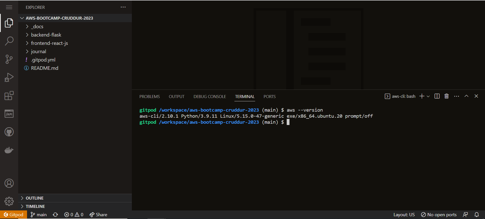
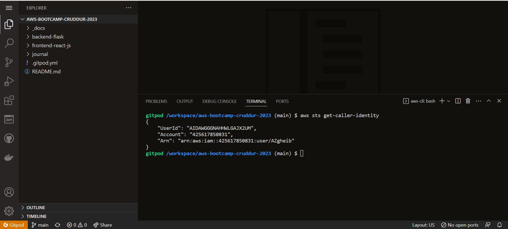
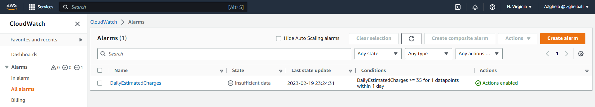
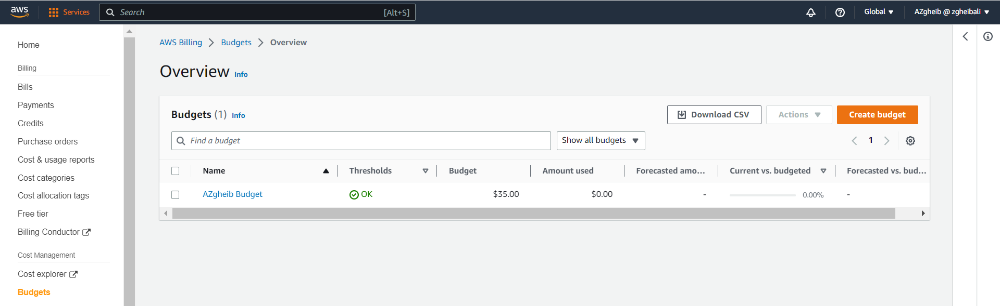
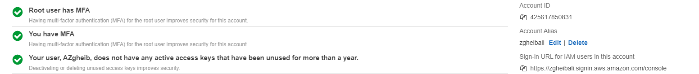

# Week 0 — Billing and Architecture

## Required Homeworks/Tasks

### Install & Verify AWS CLI 

#### Install AWS CLI

We can install the AWS CLI by updating our **.gitpod.yml** file to include the installation task:
 
```
tasks:
  - name: aws-cli
    env:
      AWS_CLI_AUTO_PROMPT: on-partial
    init: |
      cd /workspace
      curl "https://awscli.amazonaws.com/awscli-exe-linux-x86_64.zip" -o "awscliv2.zip"
      unzip awscliv2.zip
      sudo ./aws/install
      cd $THEIA_WORKSPACE_ROOT
```
#### Verify AWS CLI on Gitpod

We can run ```aws --version``` on the gitpod environment to ensure that **AWS CLI** was installed successfully!



### AWS Credentials

#### Create IAM user & Generate AWS Credentials

- Go to [IAM Users Console](https://us-east-1.console.aws.amazon.com/iamv2/home?region=us-east-1#/users) 
- Create a new user
- `Enable console access` for the user
- Create a new `Admin` Group and apply `AdministratorAccess`
- Create the user and go find and click into the user
- Click on `Security Credentials` and `Create Access Key`
- Choose AWS CLI Access
- Download the CSV with the credentials

#### Validate AWS Credentials on Gitpod

First of all, We launch our Gitpod workspace.

We will set these credentials for the current bash terminal
```
export AWS_ACCESS_KEY_ID=""
export AWS_SECRET_ACCESS_KEY=""
export AWS_DEFAULT_REGION=us-east-1
```

We'll tell Gitpod to remember these credentials if we relaunch our workspaces
```
gp env AWS_ACCESS_KEY_ID=""
gp env AWS_SECRET_ACCESS_KEY=""
gp env AWS_DEFAULT_REGION=us-east-1
```

We can confirm that these credentials are working by running the CLI command below:

```aws sts get-caller-identity```

Finally we receive a successful response



### Enable Billing 

We need to turn on Billing Alerts to recieve alerts...

- In your Root Account go to the [Billing Page](https://console.aws.amazon.com/billing/)
- Under `Billing Preferences` Choose `Receive Billing Alerts`
- Save Preferences

### Creating a Billing Alarm

#### Create SNS Topic

- We need an SNS topic before we create an alarm.
- The SNS topic is what will delivery us an alert when we get overbilled
- [aws sns create-topic](https://docs.aws.amazon.com/cli/latest/reference/sns/create-topic.html)

We'll create a SNS Topic
```sh
aws sns create-topic --name azgheib-billing-alarm
```
which will return a TopicARN

We'll create a subscription supply the TopicARN and our Email
```sh
aws sns subscribe \
    --topic-arn arn:aws:sns:us-east-1:425617850831:azgheib-billing-alarm \
    --protocol email \
    --notification-endpoint zgheibali@gmail.com
```

Check your email and confirm the subscription

#### Create Alarm

- [aws cloudwatch put-metric-alarm](https://docs.aws.amazon.com/cli/latest/reference/cloudwatch/put-metric-alarm.html)
- [Create an Alarm via AWS CLI](https://aws.amazon.com/premiumsupport/knowledge-center/cloudwatch-estimatedcharges-alarm/)
- We need to update the configuration json script with the TopicARN we generated earlier
- We are just a json file because --metrics is is required for expressions and so its easier to us a JSON file.

```sh
aws cloudwatch put-metric-alarm --cli-input-json file://aws/json/alarm_config.json
```
#### Confirm that the billing alarm was created on the AWS console



### Create an AWS Budget

[aws budgets create-budget](https://docs.aws.amazon.com/cli/latest/reference/budgets/create-budget.html)

```sh
aws budgets create-budget \
    --account-id 425617850831 \
    --budget file://aws/json/budget.json \
    --notifications-with-subscribers file://aws/json/budget-notifications-with-subscribers.json
```

#### Confirm that the budget was created on the AWS console



### Conceptual/Napkin Diagram

**Image and Description to be Added**

### Logical Diagram

**Image and Description to be Added**

## Homework Challenges

### Delete Root credentials & Setup MFA

- I deleted root account credentials 
- I completed MFA Setup for the root account using Auth
- I created an IAM user + access credentials
- I completed MFA setup for my IAM user as well



### Additional challenges ( CI/CD Diagram | Service limit research + ticket | Well architected framework | Health Dashboard + SNS + EventBridge)