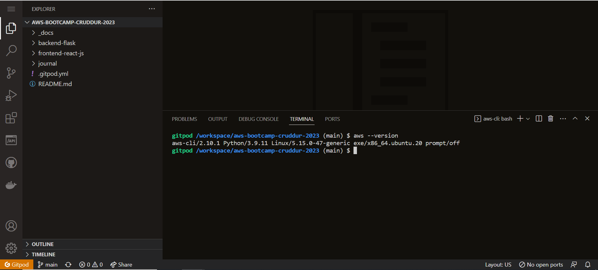

# Week 0 — Billing and Architecture

## Required Homeworks/Tasks

### Install & Verify AWS CLI 

#### Install AWS CLI

We can install the AWS CLI by updating our **.gitpod.yml** file to include the installation task:
 
```
tasks:
  - name: aws-cli
    env:
      AWS_CLI_AUTO_PROMPT: on-partial
    init: |
      cd /workspace
      curl "https://awscli.amazonaws.com/awscli-exe-linux-x86_64.zip" -o "awscliv2.zip"
      unzip awscliv2.zip
      sudo ./aws/install
      cd $THEIA_WORKSPACE_ROOT
```
#### Verify AWS CLI on Gitpod

We can run ```aws --version``` on the gitpod environment to ensure that **AWS CLI** was installed successfully!



### AWS Credentials

#### Create IAM user & Generate AWS Credentials

- Go to [IAM Users Console](https://us-east-1.console.aws.amazon.com/iamv2/home?region=us-east-1#/users) 
- Create a new user
- `Enable console access` for the user
- Create a new `Admin` Group and apply `AdministratorAccess`
- Create the user and go find and click into the user
- Click on `Security Credentials` and `Create Access Key`
- Choose AWS CLI Access
- Download the CSV with the credentials

#### Validate AWS Credentials on Gitpod

First of all, We launch our Gitpod workspace.

We will set these credentials for the current bash terminal
```
export AWS_ACCESS_KEY_ID=""
export AWS_SECRET_ACCESS_KEY=""
export AWS_DEFAULT_REGION=us-east-1
```

We'll tell Gitpod to remember these credentials if we relaunch our workspaces
```
gp env AWS_ACCESS_KEY_ID=""
gp env AWS_SECRET_ACCESS_KEY=""
gp env AWS_DEFAULT_REGION=us-east-1
```

We can confirm that these credentials are working by running the CLI command below:

```aws sts get-caller-identity```

Finally we receive a successful response


