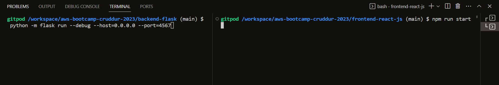
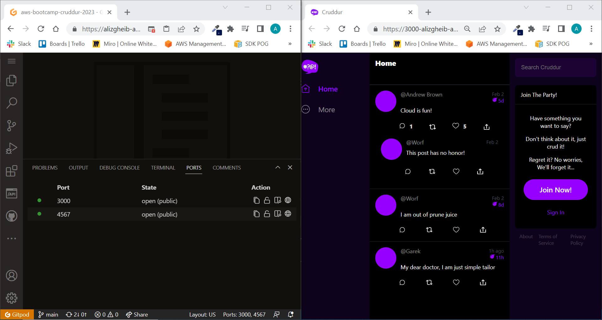
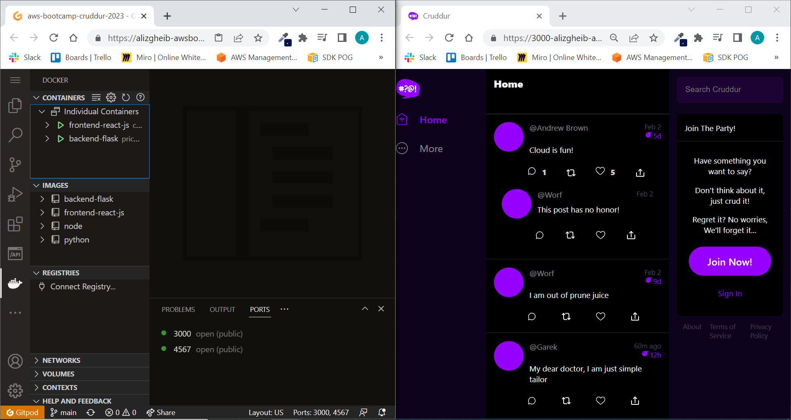

# Week 1 — App Containerization

## Required Homeworks/Tasks

### Running Cruddur without Docker

#### Set up the backend:

Navigate into the correct directory:
```
cd backend-flask
```
Install the required dependencies based on requirements.txt
```
pip3 install -r requirements.txt
```
Add the necessary environment variables
```
export BACKEND_URL="https://4567-${GITPOD_WORKSPACE_ID}.${GITPOD_WORKSPACE_CLUSTER_HOST}"
export FRONTEND_URL="https://3000-${GITPOD_WORKSPACE_ID}.${GITPOD_WORKSPACE_CLUSTER_HOST}"
```
Run flask backend server
```
python3 -m flask run --debug --host=0.0.0.0 --port=4567
```

#### Set up the frontend:

Navigate into the correct directory:
```
cd frontend-react-js
```
Install the required dependencies based on package.json
```
npm install
```
Add the necessary environment variables
```
export REACT_APP_BACKEND_URL="https://4567-${GITPOD_WORKSPACE_ID}.${GITPOD_WORKSPACE_CLUSTER_HOST}"
```
Run the react application
```
npm run start
```
#### Image showing the process of running the commands

#### Image showing Crudder up and running


### Running Cruddur using Dockerfile

#### Set up the backend:

1. Create a new Dockerfile in the backend-flask directory:
```
FROM python:3.10-slim-buster

WORKDIR /backend-flask

COPY requirements.txt requirements.txt

RUN pip3 install -r requirements.txt

COPY . .

ENV FLASK_DEBUG=1

EXPOSE ${PORT}

CMD [ "python3", "-m" , "flask", "run", "--host=0.0.0.0", "--port=4567"]
```

2. Build backend-flask docker image

```
docker build ./backend-flask -t backend-flask
```
3. Add the necessary environment variables

```
export BACKEND_URL="https://4567-${GITPOD_WORKSPACE_ID}.${GITPOD_WORKSPACE_CLUSTER_HOST}"
export FRONTEND_URL="https://3000-${GITPOD_WORKSPACE_ID}.${GITPOD_WORKSPACE_CLUSTER_HOST}"
```

4. Run backend-flask container from the image ( detached mode )

```
docker run -p 4567:4567 -e BACKEND_URL -e FRONTEND_URL -d backend-flask
```

#### Set up the frontend:

1. Create a new Dockerfile in the frontend-react-js directory:

```
FROM node:16.18

ENV PORT=3000

WORKDIR /frontend-react-js

COPY . .

RUN npm install

EXPOSE ${PORT}

CMD ["npm", "start"]
```

2. Build frontend-react-js docker image

```
docker build ./frontend-react-js -t frontend-react-js
```

3. Add the necessary environment variables

```
export REACT_APP_BACKEND_URL="https://4567-${GITPOD_WORKSPACE_ID}.${GITPOD_WORKSPACE_CLUSTER_HOST}"
```

4. Run frontend-react-js container from the image ( detached mode )

```
docker run -p 3000:3000 -e REACT_APP_BACKEND_URL -d frontend-react-js
```

#### Image showing Crudder up and running


### Running Cruddur using Docker compose

### Adding DynamoDB Local and Postgres

#### Postgres

#### DynamoDB Local

#### Volumes

## Homework Challenges

### Running Cruddur outside of Gitpod / Codespaces ( Docker Desktop )

### Pushing docker images to DockerHub

### Pushing docker images to AWS ECR
