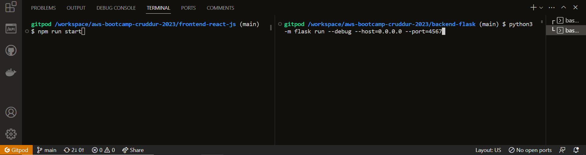
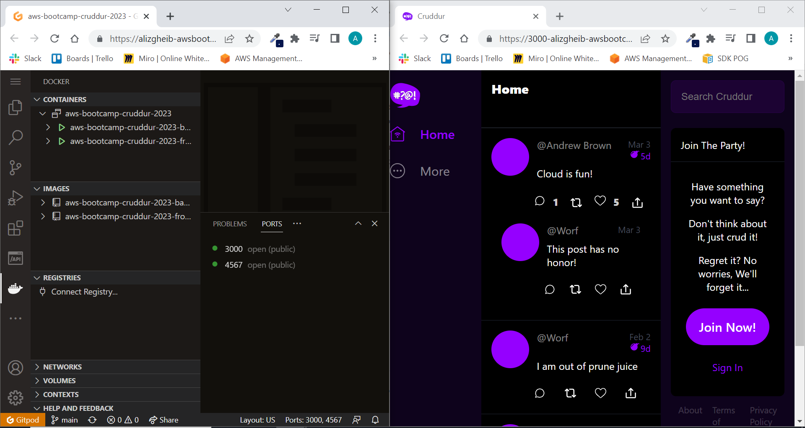
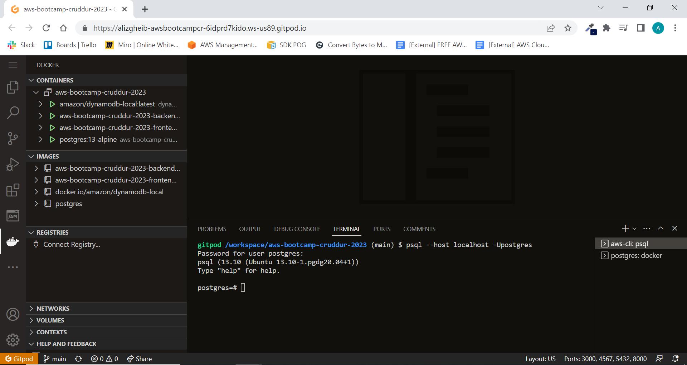
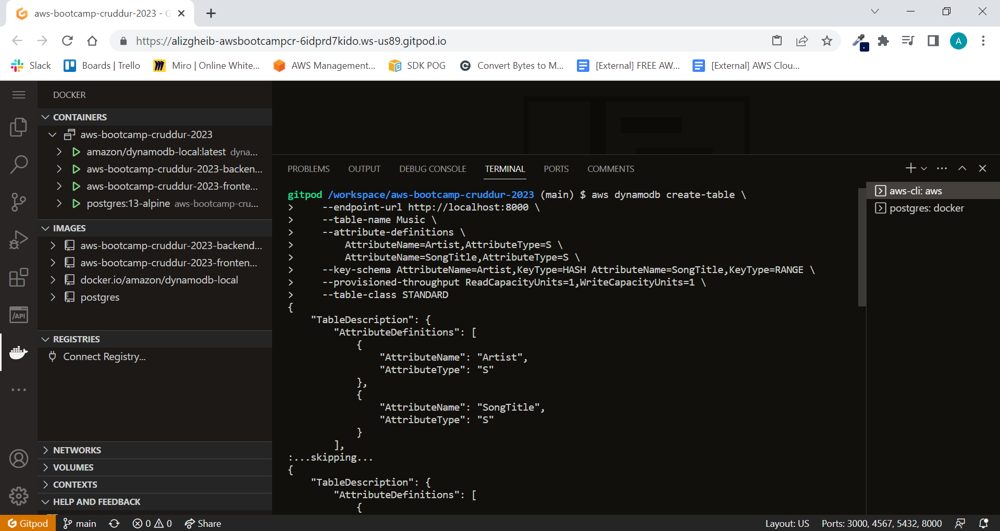

# Week 1 — App Containerization

## Required Homeworks/Tasks

### Running Cruddur without Docker

#### Set up the backend:

Navigate into the correct directory:
```
cd backend-flask
```
Install the required dependencies based on requirements.txt
```
pip3 install -r requirements.txt
```
Add the necessary environment variables
```
export BACKEND_URL="https://4567-${GITPOD_WORKSPACE_ID}.${GITPOD_WORKSPACE_CLUSTER_HOST}"
export FRONTEND_URL="https://3000-${GITPOD_WORKSPACE_ID}.${GITPOD_WORKSPACE_CLUSTER_HOST}"
```
Run flask backend server
```
python3 -m flask run --debug --host=0.0.0.0 --port=4567
```

#### Set up the frontend:

Navigate into the correct directory:
```
cd frontend-react-js
```
Install the required dependencies based on package.json
```
npm install
```
Add the necessary environment variables
```
export REACT_APP_BACKEND_URL="https://4567-${GITPOD_WORKSPACE_ID}.${GITPOD_WORKSPACE_CLUSTER_HOST}"
```
Run the react application
```
npm run start
```
#### Image showing the process of running the commands

#### Image showing Crudder up and running


### Running Cruddur using Dockerfile

#### Set up the backend:

1. Create a new Dockerfile in the backend-flask directory:
```
FROM python:3.10-slim-buster

WORKDIR /backend-flask

COPY requirements.txt requirements.txt

RUN pip3 install -r requirements.txt

COPY . .

ENV FLASK_DEBUG=1

EXPOSE ${PORT}

CMD [ "python3", "-m" , "flask", "run", "--host=0.0.0.0", "--port=4567"]
```

2. Build backend-flask docker image

```
docker build ./backend-flask -t backend-flask
```
3. Add the necessary environment variables

```
export BACKEND_URL="https://4567-${GITPOD_WORKSPACE_ID}.${GITPOD_WORKSPACE_CLUSTER_HOST}"
export FRONTEND_URL="https://3000-${GITPOD_WORKSPACE_ID}.${GITPOD_WORKSPACE_CLUSTER_HOST}"
```

4. Run backend-flask container from the image ( detached mode )

```
docker run -p 4567:4567 -e BACKEND_URL -e FRONTEND_URL -d backend-flask
```

#### Set up the frontend:

1. Create a new Dockerfile in the frontend-react-js directory:

```
FROM node:16.18

ENV PORT=3000

WORKDIR /frontend-react-js

COPY . .

RUN npm install

EXPOSE ${PORT}

CMD ["npm", "start"]
```

2. Build frontend-react-js docker image

```
docker build ./frontend-react-js -t frontend-react-js
```

3. Add the necessary environment variables

```
export REACT_APP_BACKEND_URL="https://4567-${GITPOD_WORKSPACE_ID}.${GITPOD_WORKSPACE_CLUSTER_HOST}"
```

4. Run frontend-react-js container from the image ( detached mode )

```
docker run -p 3000:3000 -e REACT_APP_BACKEND_URL -d frontend-react-js
```

#### Image showing Crudder up and running


### Running Cruddur using Docker compose

#### Create docker-compose.yml

We create in the root directory **docker-compose.yml** file and we add the following to it:

```
version: "3.8"
services:
  backend-flask:
    environment:
      FRONTEND_URL: "https://3000-${GITPOD_WORKSPACE_ID}.${GITPOD_WORKSPACE_CLUSTER_HOST}"
      BACKEND_URL: "https://4567-${GITPOD_WORKSPACE_ID}.${GITPOD_WORKSPACE_CLUSTER_HOST}"
    build: ./backend-flask
    ports:
      - "4567:4567"
    volumes:
      - ./backend-flask:/backend-flask
  frontend-react-js:
    environment:
      REACT_APP_BACKEND_URL: "https://4567-${GITPOD_WORKSPACE_ID}.${GITPOD_WORKSPACE_CLUSTER_HOST}"
    build: ./frontend-react-js
    ports:
      - "3000:3000"
    volumes:
      - ./frontend-react-js:/frontend-react-js
      - /frontend-react-js/node_modules
# the name flag is a hack to change the default prepend folder
# name when outputting the image names
networks: 
  internal-network:
    driver: bridge
    name: cruddur
```
You may notice 2 volumes for the **frontend-react-js** service. it's not a coincidence and the second volume was added for a specific reason.

```
# docker-compose.yaml
...
volumes:
  - ./frontend-react-js:/frontend-react-js
  - /frontend-react-js/node_modules 👈
```

Why do we do this?
- By adding the - /frontend-react-js/node_modules line, we are telling Docker to create a second volume (an anonymous volume) in addition to the one we already have, ./frontend-react-js:/frontend-react-js.
- When the containers are run, the Docker engine will use this secondary volume (/frontend-react-js/node-modules) to access the dependencies needed by the React application.
- This means that we no longer need to access the resources on our local computer. We only need the resources in the Docker container.
- As a result, we can remove the need for Node or any other local dependencies entirely.

The same issue discussed on [stackoverflow](https://stackoverflow.com/questions/30043872/docker-compose-node-modules-not-present-in-a-volume-after-npm-install-succeeds)

#### We build and run the containers

```
docker compose up
```

#### Image showing Crudder up and running


### Adding DynamoDB Local and Postgres

We are going to use Postgres and DynamoDB local in future labs We can bring them in as containers and reference them externally

Lets integrate the following into our existing docker compose file:

#### Postgres

1. Add postgres service and necessary volumes to **docker-compose.yml**

```
services:
  db:
    image: postgres:13-alpine
    restart: always
    environment:
      - POSTGRES_USER=postgres
      - POSTGRES_PASSWORD=password
    ports:
      - '5432:5432'
    volumes: 
      - db:/var/lib/postgresql/data
volumes:
  db:
    driver: local
```

2. Add postgres client into **.gitpod.yml**

```
  - name: postgres
    init: |
      curl -fsSL https://www.postgresql.org/media/keys/ACCC4CF8.asc|sudo gpg --dearmor -o /etc/apt/trusted.gpg.d/postgresql.gpg
      echo "deb http://apt.postgresql.org/pub/repos/apt/ `lsb_release -cs`-pgdg main" |sudo tee  /etc/apt/sources.list.d/pgdg.list
      sudo apt update
      sudo apt install -y postgresql-client-13 libpq-dev
```

3. verify that postgres is setup successfully



#### DynamoDB Local

1. Add DynamoDB Local service to **docker-compose.yml**

```
services:
  dynamodb-local:
    # https://stackoverflow.com/questions/67533058/persist-local-dynamodb-data-in-volumes-lack-permission-unable-to-open-databa
    # We needed to add user:root to get this working.
    user: root
    command: "-jar DynamoDBLocal.jar -sharedDb -dbPath ./data"
    image: "amazon/dynamodb-local:latest"
    container_name: dynamodb-local
    ports:
      - "8000:8000"
    volumes:
      - "./docker/dynamodb:/home/dynamodblocal/data"
    working_dir: /home/dynamodblocal
```
2. verify that DynamoDB Local is setup successfully



## Homework Challenges

### Running Cruddur outside of Gitpod / Codespaces ( Docker Desktop )

### Pushing docker images to DockerHub

### Pushing docker images to AWS ECR
