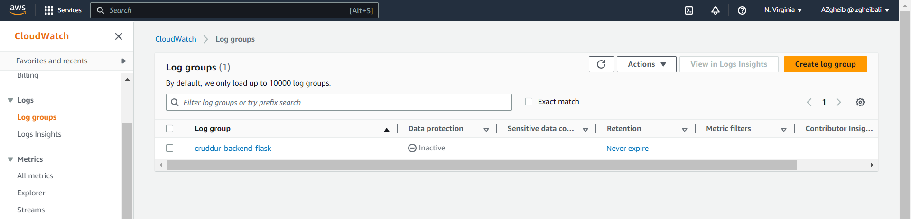
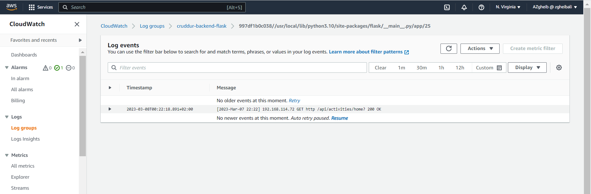
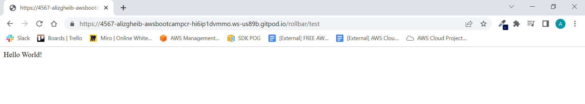
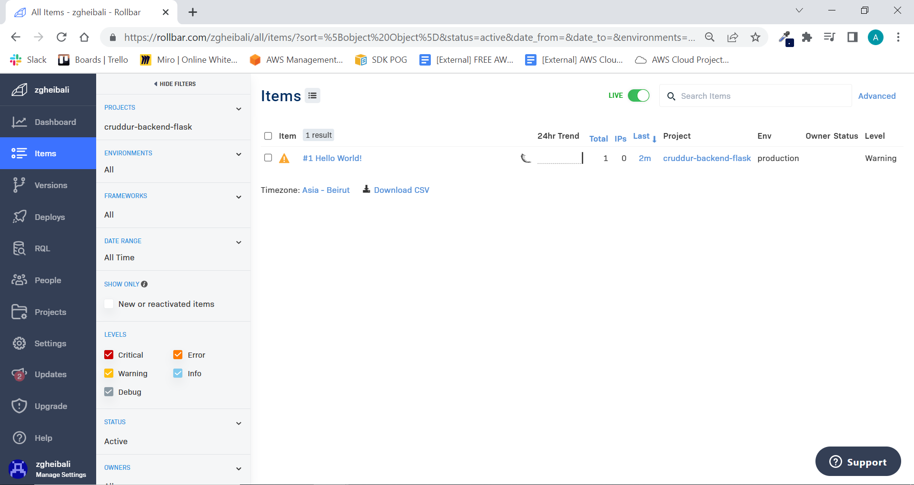
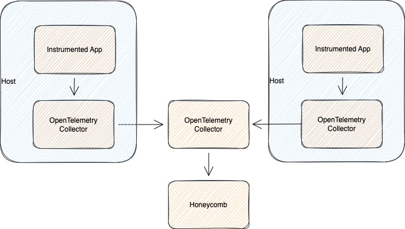
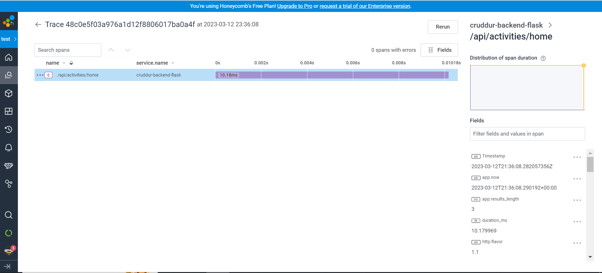
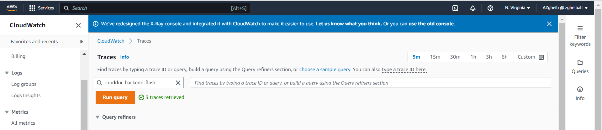
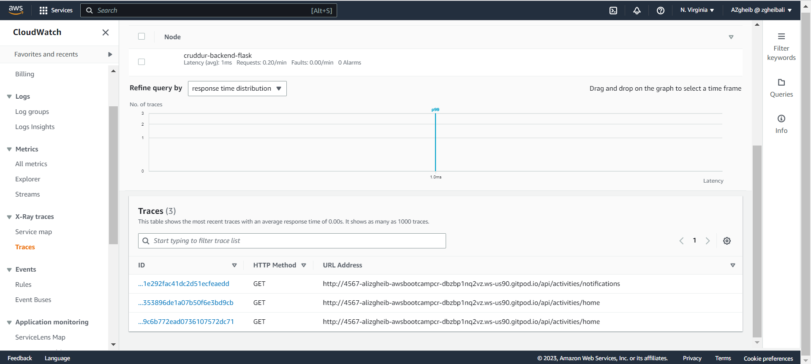

# Week 2 — Distributed Tracing

## Required Homeworks/Tasks

### CloudWatch Logs

#### Setup CloudWatch with our Flask app

1. add ```watchtower``` to the ```requirements.txt```

2. add the necessary imports 

```
import watchtower
import logging
from time import strftime
```

3. setup watchtower to ouput logs to **cruddur-backend-flask** log group on AWS CloudWatch

```
LOGGER = logging.getLogger(__name__)
LOGGER.setLevel(logging.DEBUG)
console_handler = logging.StreamHandler()
cw_handler = watchtower.CloudWatchLogHandler(log_group='cruddur-backend-flask')
LOGGER.addHandler(console_handler)
LOGGER.addHandler(cw_handler)
```

4. configure the **LOGGER** to ouput request info after each API call

```
@app.after_request
def after_request(response):
    timestamp = strftime('[%Y-%b-%d %H:%M]')
    LOGGER.info('%s %s %s %s %s %s', timestamp, request.remote_addr, request.method, request.scheme, request.full_path, response.status)
    return response
```

#### Verify the integration on CloudWatch

1. we run our application using ```docker compose up``` command and we open the home page

2. we verify that **cruddur-backend-flask** was created successfully on AWS CloudWatch log groups



3. we verify that **watchtower** is outputting logs on our log group



### Rollbar

#### Setup Rollbar project

1. we visit [rollbar](https://rollbar.com/) website

2. we create a new project **cruddur-backend-flask**

#### Setup Rollbar with our Flask app

1. add ```blinker``` and ```rollbar``` to ```requirements.txt```

2. We need to set our access token

```
export ROLLBAR_ACCESS_TOKEN=""
gp env ROLLBAR_ACCESS_TOKEN=""
```

3. Add to backend-flask for ```docker-compose.yml```

```
ROLLBAR_ACCESS_TOKEN: "${ROLLBAR_ACCESS_TOKEN}"
```

4. add the necessary imports

```
import rollbar
import rollbar.contrib.flask
from flask import got_request_exception
```

5. setup our app to ouput logs to **cruddur-backend-flask** on Rollbar

```
rollbar_access_token = os.getenv('ROLLBAR_ACCESS_TOKEN')
@app.before_first_request
def init_rollbar():
    """init rollbar module"""
    rollbar.init(
        # access token
        rollbar_access_token,
        # environment name
        'production',
        # server root directory, makes tracebacks prettier
        root=os.path.dirname(os.path.realpath(__file__)),
        # flask already sets up logging
        allow_logging_basic_config=False)

    # send exceptions from `app` to rollbar, using flask's signal system.
    got_request_exception.connect(rollbar.contrib.flask.report_exception, app)
```

6. We add a new endpoint in ```app.py``` to test our rollbar integration

```
@app.route('/rollbar/test')
def rollbar_test():
    rollbar.report_message('Hello World!', 'warning')
    return "Hello World!"
```

#### Verify the integration on Rollbar

1. we run our application using ```docker compose up``` command

2. we verify that the ```/rollbar/test``` endpoint is returning a 200 response



3. we verify that we are receiving logs on Rollbar



### HoneyComb 

#### Introduction

Instead of doing the setup that was done live. I'll be implementing our backend flask application to write to **otel collector**. this is more scalable approach and will allow us to add other backend services and our react application as well in the future.

More information can be found on the official [OpenTelemetry](https://opentelemetry.io/docs/collector/) website

Here's a simple illustration to showcase the approach that we are trying to implement for our cruddur application.



#### Setup HoneyComb project

1. we visit [HoneyComb](https://www.honeycomb.io/) website

2. Created a new enviroment and retrieve our api key

#### Setup HoneyComb with our Flask app

1. add environment variables

```
export HONEYCOMB_API_KEY=""
gp env HONEYCOMB_API_KEY=""
```

2. add the list below to the ```requirements.txt```

```
opentelemetry-api 
opentelemetry-sdk 
opentelemetry-exporter-otlp-proto-http 
opentelemetry-instrumentation-flask 
opentelemetry-instrumentation-requests
```

3. add the following environment variables to our **backend-flask** service.

```
version: "3.8"
services:
    backend-flask:
        environment:

            # other environment variables

            OTEL_EXPORTER_OTLP_ENDPOINT: "http://otel-collector:4318"
            OTEL_SERVICE_NAME: "cruddur-backend-flask"

    # other services
```

this will tell our backend flask application to send the backend traces to the **otel-collector** that we are going to create shorly.

4. add the **otel-collector** service to our ```docker-compose.yml``` file

```
version: "3.8"
services:

  # other services

  otel-collector:
    image: otel/opentelemetry-collector:0.67.0
    environment:
      HONEYCOMB_API_KEY: "${HONEYCOMB_API_KEY}"
      FRONTEND_URL: "https://3000-${GITPOD_WORKSPACE_ID}.${GITPOD_WORKSPACE_CLUSTER_HOST}"
    command: ["--config=/etc/otel-collector-config.yaml"]
    volumes:
      - ./otel-collector-config.yaml:/etc/otel-collector-config.yaml
    ports:
      - "1888:1888"   # pprof extension
      - "8888:8888"   # Prometheus metrics exposed by the collector
      - "8889:8889"   # Prometheus exporter metrics
      - "13133:13133" # health_check extension
      - "4317:4317"   # OTLP gRPC receiver
      - "4318:4318"   # OTLP http receiver
      - "55679:55679" # zpages extension
```
5. create the ```otel-collector-config.yaml``` config file that will be used by the **otel collector**

```
receivers:
  otlp:
    protocols:
      http:
        cors:
          allowed_origins:
            - "${FRONTEND_URL}" # this will allow trace requests from the frontend ( To solve CORS issues )
                                # It's not required for the backend service
processors:
  batch:

exporters:
  otlp:
    endpoint: "api.honeycomb.io:443"
    headers:
      "x-honeycomb-team": "${HONEYCOMB_API_KEY}"

service:
  pipelines:
    traces:
      receivers: [otlp]
      processors: [batch]
      exporters: [otlp]
```

5. add necessary changes to ```app.py```

```
from opentelemetry import trace
from opentelemetry.instrumentation.flask import FlaskInstrumentor
from opentelemetry.instrumentation.requests import RequestsInstrumentor
from opentelemetry.exporter.otlp.proto.http.trace_exporter import OTLPSpanExporter
from opentelemetry.sdk.trace import TracerProvider
from opentelemetry.sdk.trace.export import BatchSpanProcessor
```

```
# Initialize tracing and an exporter that can send data to Honeycomb
provider = TracerProvider()
processor = BatchSpanProcessor(OTLPSpanExporter())
provider.add_span_processor(processor)
trace.set_tracer_provider(provider)
tracer = trace.get_tracer(__name__)
```

```
# Initialize automatic instrumentation with Flask
app = Flask(__name__)
FlaskInstrumentor().instrument_app(app)
RequestsInstrumentor().instrument()
```
#### Validate the automated backend instrumentation

1. we run our application using ```docker compose up``` command

2. we visit our home page by opening the link below:

https://3000-alizgheib-awsbootcampcr-06dny5wukq3.ws-us90.gitpod.io/

3. we validate on HoneyComb dashboard that we have a new dataset **cruddur-backend-flask** created and that we are successfully receiving data from our **backend-flask** service


### X-Ray

#### Setup X-Ray with our Flask app

1. add ```aws-xray-sdk``` to the ```requirements.txt``` file

2. add the following environment variables to our **backend-flask** service.

```
version: "3.8"
services:
    backend-flask:
        environment:

            # other environment variables

            AWS_XRAY_DAEMON_ADDRESS: "xray-daemon:2000"

    # other services
```

this will tell our backend flask application to send the backend traces to the **xray-daemon** that we are going to create shorly.

3. add the **xray-daemon** service to our ```docker-compose.yml``` file

```
version: "3.8"
services:

  # other services

  xray-daemon:
      image: "amazon/aws-xray-daemon"
      environment:
          AWS_ACCESS_KEY_ID: "${AWS_ACCESS_KEY_ID}"
          AWS_SECRET_ACCESS_KEY: "${AWS_SECRET_ACCESS_KEY}"
          AWS_REGION: "us-east-1"
      command:
          - "xray -o -b xray-daemon:2000"
      ports:
          - 2000:2000/udp
```
4. create a group on aws-xray to ensure we could group our traces

```
aws xray create-group \
--group-name "cruddur-backend-flask" \
--filter-expression "service(\"cruddur-backend-flask\")"
```

5. we create a sampling as follow:

```
{
    "SamplingRule": {
        "RuleName": "cruddur-backend-flask",
        "ResourceARN": "*",
        "Priority": 9000,
        "FixedRate": 0.1,
        "ReservoirSize": 5,
        "ServiceName": "cruddur-backend-flask",
        "ServiceType": "*",
        "Host": "*",
        "HTTPMethod": "*",
        "URLPath": "*",
        "Version": 1
    }
}
```

```
aws xray create-sampling-rule --cli-input-json file://aws/json/xray.json
```

6. add necessary changes to ```app.py```

```
from aws_xray_sdk.core import xray_recorder
from aws_xray_sdk.ext.flask.middleware import XRayMiddleware
```

```
xray_recorder.configure(service='cruddur-backend-flask')
XRayMiddleware(app, xray_recorder)
```
#### Validate the automated backend instrumentation

1. we run our application using ```docker compose up``` command

2. we navigate around the pages of our Currdur application ( ex: home, notifications, messages, etc.. )

3. we validate on AWS X-Ray dashboard that we have new traces under our **cruddur-backend-flask** group




## Homework Challenges
